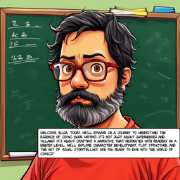
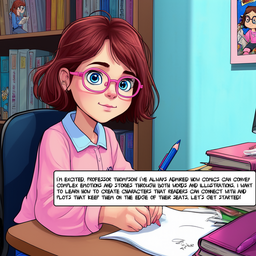

# comic1111generator

An Automatic1111 comic panel images generator with multiagent chat image validation system




you can find a coplete comic generation example in [comic sample](examples/fumetto_answer_agent_rag_1749715128.247098.pdf)

# Setup

developed and tested with python 3.10.9 on Kubuntu 24.10 use of Python virtualenv is encouraged. 

## Pre req
In order to use comic1111generator you need:

* **automatic1111** (tested on v 1.10.1 installation) https://github.com/AUTOMATIC1111/stable-diffusion-webui . In order to get the things running you have to run it with --api option
* **gemma3** a simple way to obtain is with **ollama** 

## Activate virtual env and install requirements

Create a virtual environment named .venv

```python -m venv .venv```

Activate the environment

```source .venv/bin/activate```

Install a package

```pip install -r requirements.txt```

Deactivate the environment

```deactivate```

# Run

## run for help

    python main.py --help

## basic usage

    python main.py -in plot.json

## multiagent chat validation

    python main.py -in plot.json --online


